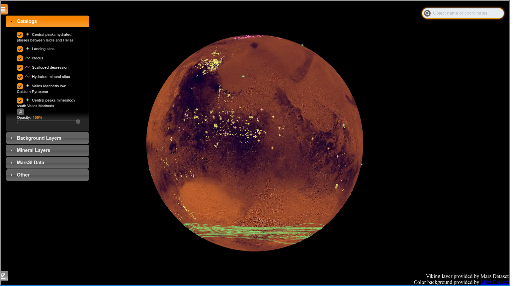

# PSUP processor

Processes PSUP catalogs and converts them to STAC.

## Dataset description

PSUP Catalogs are Hydrated mineral terrains, Central peaks hydrated phases between Isidis and Hellas, Central peaks mineralogy south Valles Marineris, Valles Marineris low Calcium-Pyroxene, Seasonal South polar cap limits, Scalloped depressions and Lobate impact craters. This dataset contains vector catalogs and their associated metadatas. All catalogs are provided in JSON file format via the "download" column.

Each Catalog is also visible in 3D over Martian surface via the PSUP module "Mars Visu".



## Features
- Convert raw PSUP JSON/vector catalogs into STAC catalogs
- Preview catalog metadata and geometries
- Download and inspect WKT files
- Export intermediate formats for analysis

## Installation

From the repository root (recommended editable install):

**With pip:**

```bash
python -m pip install -e .
```

You can run the CLI either as the installed console script or via the module:

- If installed as console script:
  - psup-stac --help
- Or run the module directly:
  - python -m psup_stac_converter.cli --help

**With uv:**

```bash
uv sync
```

You can run the CLI either as the installed console script or via the module:

- If installed as console script:
  - uv run psup-stac --help
- Or run the module directly:
  - uv run python -m psup_stac_converter.cli --help


## Quickstart

1. Prepare a metadata CSV (see schema below) and place raw catalogs in a folder (e.g. `./data/raw/catalogs`).
2. Optionally create a YAML config file with defaults (example below).
3. Create a STAC catalog:

Using installed console script:
```bash
psup-stac create-stac-catalog --md-file ./data/raw/vector.csv --catalog ./data/raw/catalogs --output ./data/processed --clean
```

Or using module run:
```bash
python -m psup_stac_converter.cli create-stac-catalog --md-file ./data/raw/vector.csv --catalog ./data/raw/catalogs --output ./data/processed --clean
```

If you use a config file you can omit repeated options:
```bash
psup-stac --from-config converter-params.yml create-stac-catalog --clean
```

## Commands and examples

- create-stac-catalog
  - Options: --md-file / -md, --catalog / -I, --output / -O, --clean / --no-clean
  - Example:
    ```bash
    psup-stac create-stac-catalog -md ./data/raw/vector.csv -I ./data/raw/catalogs -O ./data/processed --clean
    ```

- preview-data
  - Options: --md-file / -md, --catalog
  - Example:
    ```bash
    psup-stac preview-data -md ./data/raw/vector.csv -I ./data/raw/catalogs
    ```

- download_wkt_files
  - Positional: file_name (CSV). Option: --in-folder / -f
  - Example:
    ```bash
    psup-stac download-wkt-files output_wkts.csv --in-folder ./data/extra
    ```
  - Note: the CLI validates that the output filename suffix ends with `csv`.

- show_wkt_projections
  - Positional: file_name. Options: --solar-body / -sb, --keywords / -k
  - Example:
    ```bash
    psup-stac show-wkt-projections ./data/extra/output_wkts.csv --solar-body Mars --keywords phobos,deimos
    ```

- format_data_for_analysis
  - Positional: file_name. Options: --format / -f, --md-file / -md, --catalog, --output-folder / -O
  - Example:
    ```bash
    psup-stac format-data-for-analysis intermediate.json --format gpkg -md ./data/raw/vector.csv --catalog ./data/raw/catalogs -O ./data/analysis
    ```

- describe_folders
  - Shows target folders resolved from config or defaults:
    ```bash
    psup-stac describe-folders
    ```

- show_possible_formats
  - Prints available export formats:
    ```bash
    psup-stac show-possible-formats
    ```

## Config file (YAML) example

The CLI accepts a config file via `--from-config` / `-c`. The settings loader expects keys similar to:

```yaml
settings:
  # The level of logging
  log_level: "INFO"
  # Logging formatter
  log_format: "%(message)s"
  # Where the user keeps their data
  data_path: "./data"
  raw_data_path: "./data/raw"
  catalog_folder_path: "./data/raw/catalogs"
  output_data_path: "./data/processed"
  intermediate_data_path: "./data/intermediate"
  extra_data_path: "./data/extra"
  metadata_file_path: "./data/raw/vector.csv"
  wkt_file_name: "wkt_solar_system.csv"

```

Place the config path when running:
```bash
psup-stac --from-config converter-params.yml create-stac-catalog
```

## Metadata CSV schema

The metadata CSV must contain at least the following columns:
- description
- name
- footprint
- keywords


|     | description           | name          | footprint                                 |       keywords |
| --: | :-------------------- | :------------ | :---------------------------------------- | -------------: |
|   0 | "A brief description" | filename.json | ((-180,-90),(-180,90),(180,90),(180,-90)) | {"kw1", "kw2"} |


Example CSV row:
```csv
description,name,footprint,keywords
"A brief description","hyd_global_290615.json","((-180,-90),(-180,90),(180,90),(180,-90))","{hydrated,global}"
```

Ensure the CSV file path provided exists where required by the command.

## Troubleshooting / tips

- If you get "Must provide a metadata file" error, either pass `--md-file` or use `--from-config` with `metadata_file_path`.
- For download-wkt-files the output file must have a `.csv` suffix (the CLI checks the suffix).
- If running via `python -m ...`, ensure your PYTHONPATH includes the project or you installed the package.
- Use `psup-stac <command> --help` to see command-specific options.

## References

- **Hydrated mineral terrains:** Carter, J., F. Poulet, J.‐P. Bibring, N. Mangold, and S. Murchie (2013), Hydrous minerals on Mars as seen by the CRISM and OMEGA imaging spectrometers: Updated global view, J. Geophys. Res. Planets, 118, 831–858, [doi: 10.1029/2012JE004145](https://agupubs.onlinelibrary.wiley.com/doi/full/10.1029/2012JE004145).

- **Central peaks hydrated phases between Isidis and Hellas:** B. Bultel, C. Quantin-Nataf, M. Andréani, H. Clénet, L. Lozac’h (2015), Deep alteration between Hellas and Isidis Basins, In Icarus Volume 260, 2015, Pages 141-160, [doi:10.1016/j.icarus.2015.06.037](https://www.sciencedirect.com/science/article/abs/pii/S0019103515002894)

- **Central peaks mineralogy south Valles Marineris:** C. Quantin, J. Flahaut, H. Clenet, P. Allemand, P. Thomas (2012), Composition and structures of the subsurface in the vicinity of Valles Marineris as revealed by central uplifts of impact craters, Icarus, Volume 221, Issue 1, 2012, Pages 436-452, [doi:10.1016/j.icarus.2012.07.031](https://www.sciencedirect.com/science/article/abs/pii/S0019103512003077).

- **Valles Marineris low Calcium-Pyroxene deposits:** J. Flahaut, C. Quantin, H. Clenet, P. Allemand, J. F. Mustard, P. Thomas (2012), Pristine Noachian crust and key geologic transitions in the lower walls of Valles Marineris: Insights into early igneous processes on Mars, In Icarus, Volume 221, Issue 1, 2012, Pages 420-435, [doi:10.1016/j.icarus.2011.12.027](https://www.sciencedirect.com/science/article/abs/pii/S0019103512000140)

- **Seasonal South polar cap limits:** F. Schmidt, B. Schmitt, S. Douté, F. Forget, J.-J. Jian, P. Martin, Y. Langevin, J.-P. Bibring (2010), Sublimation of the Martian CO2 Seasonal South Polar Cap, In Planetary and Space Science, Volume 58, Issues 10, 2010, Pages 1129-1138, [doi:10.1016/j.pss.2010.03.018](https://www.sciencedirect.com/science/article/pii/S0032063310001005).

- **Scalloped depressions:** A.Séjourné, F.Costard, J.Gargani, R.J.Soare, C.Marmo (2012), Evidence of an eolian ice-rich and stratified permafrost in Utopia Planitia, Mars, In Icarus, Volume 60, Issue 1, 2012, Pages 248-254, [doi:10.1016/j.pss.2011.09.004](https://www.sciencedirect.com/science/article/pii/S0032063311002790).

- **Lobate impact craters:** F.M Costard (1989), The spatial distribution of volatiles in the Martian hydrolithosphere, Earth Moon Planet, Volume 45, Pages 265-290. [doi:10.1007/BF00057747](https://link.springer.com/article/10.1007%2FBF00057747).

## Contributing
- Open an issue or PR with improvements.
- Add unit tests for new features.
---

[PSUP Catalog](http://psup.ias.u-psud.fr/sitools/client-user/index.html?project=PLISonMars)
